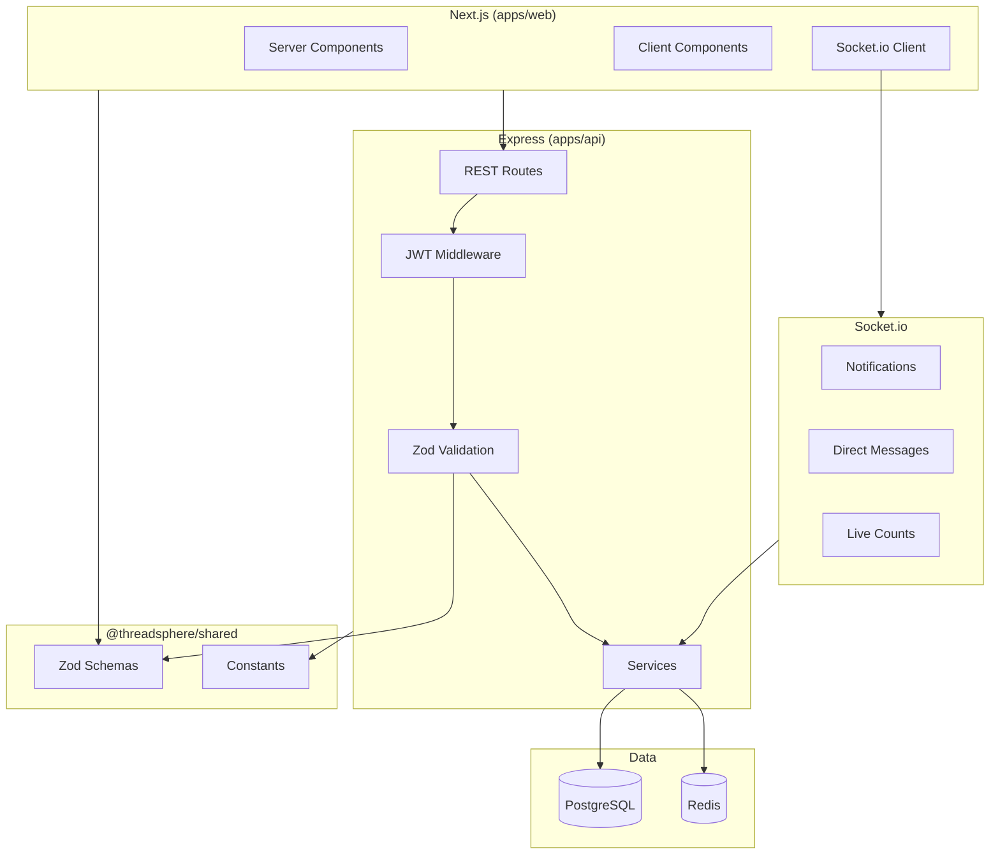
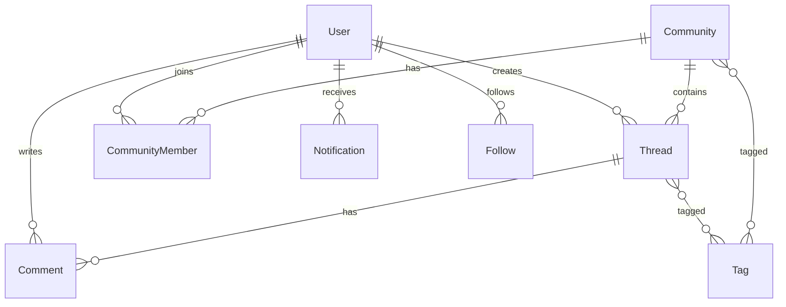

# ThreadSphere Architecture

## System Overview



## Monorepo Layout

```
threadsphere/
├── apps/
│   ├── web/          # Next.js 15 App Router
│   └── api/          # Express + Socket.io
├── packages/
│   └── shared/       # Zod schemas, constants, types
├── docs/
│   ├── PROGRESS.md   # Session log & task tracker
│   └── ARCHITECTURE.md
├── .cursor/rules/    # AI coding rules
├── .graphify/        # Graphify knowledge graph
└── docker-compose.yml
```

## Data Model (Planned)



## Validation Flow

All user-generated content follows this pipeline:

1. **Client** — Zod schema hints (from `@threadsphere/shared`)
2. **API** — Re-validate with same schema (never trust client)
3. **Sanitize** — HTML via sanitize-html (Phase 2)
4. **Persist** — Store `contentHtml` + `contentPlain` for search

## Realtime Events

| Event | Room | Purpose |
|-------|------|---------|
| `notification:new` | `user:{id}` | Bell badge updates |
| `thread:comment` | `thread:{id}` | Live comment count |
| `thread:reaction` | `thread:{id}` | Live reaction count |
| `message:send` | `dm:{id}` | Direct messages |
| `join:user` | — | Subscribe to personal room |

## Key Routes (Planned)

| Method | Path | Description |
|--------|------|-------------|
| GET | `/health` | API health ✅ |
| POST | `/auth/register` | Create account |
| POST | `/auth/login` | Sign in |
| GET | `/communities/:slug` | Community detail |
| POST | `/threads` | Create thread (validated) |
| GET | `/threads/:id` | Thread detail |
| GET | `/search` | Full-text + tag search |

## Thread Detail Page Structure

```
/c/[communitySlug]/t/[threadSlug]
├── Left sidebar   — community nav, rules
├── Main           — title, tags, rich content, comments
└── Right sidebar  — author card, related threads
```

Tags: 1–5 required, searchable multi-select, clickable chips linking to `/search?tag=`.
