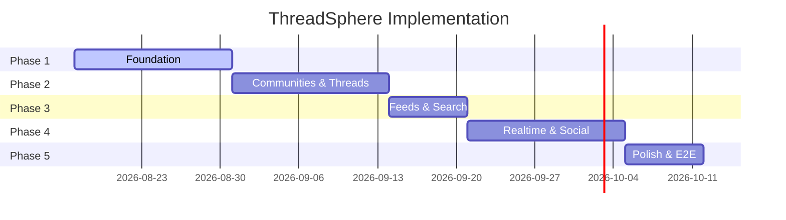

# ThreadSphere — Development Progress

> Living document. Update this file at the end of each work session.
> Last updated: **2026-08-17**

## Repository

- **Remote:** https://github.com/saadsrabon/threadforum.git
- **Stack:** Next.js 15+ · Express · Socket.io · PostgreSQL · Redis · Prisma · Zod
- **Knowledge graph:** [Graphify](https://graphify.net/) — query with `/graphify` or `npm run graphify:query "..."`

---

## Current Phase: 1 — Foundation

| Task | Status | Notes |
|------|--------|-------|
| Monorepo scaffold (Turbo) | ✅ Done | `apps/web`, `apps/api`, `packages/shared` |
| Shared Zod validation schemas | ✅ Done | auth, thread, community |
| Express + Socket.io skeleton | ✅ Done | `/health`, `join:user` room |
| Next.js app shell | ✅ Done | App Router + Tailwind |
| Docker Compose (Postgres, Redis) | ✅ Done | `docker-compose.yml` |
| Cursor project rules | ✅ Done | `.cursor/rules/` |
| Graphify integration | ✅ Done | `.graphify/`, Cursor skill rule |
| Prisma schema + migrations | ⏳ Next | User, Community, Thread, Tag, Comment |
| Auth (register/login/JWT) | ⏳ Next | httpOnly cookies |
| 3-column layout shell | ⏳ Next | Header, sidebars, footer from UI refs |

---

## Phase Roadmap



| Phase | Focus | Key deliverables |
|-------|-------|------------------|
| **1** | Foundation | Monorepo, auth, DB, layout shell |
| **2** | Communities & Threads | Wizard, thread detail, tags, Tiptap, validation |
| **3** | Feeds & Search | Home feed, filters, tag pages |
| **4** | Realtime & Social | Notifications, DMs, follow/connect |
| **5** | Polish | Moderation, perf, E2E tests |

---

## Session Log

### 2026-08-17 — Project bootstrap

**Done**
- Created Turborepo monorepo structure
- Scaffolded Next.js (`apps/web`) with App Router + Tailwind
- Created Express API with health check + Socket.io stub
- Added `@threadsphere/shared` with Zod schemas (auth, thread, community)
- Added Docker Compose for Postgres + Redis
- Wrote Cursor rules (project, API, frontend, validation, graphify)
- Integrated Graphify for codebase knowledge graph
- Initial commit pushed to GitHub

**Next session**
1. Add Prisma schema (User, Community, Thread, Tag, Comment, Notification)
2. Implement auth routes with shared Zod validation
3. Build 3-column layout matching UI mockups
4. Wire web → API health check

---

## UI Reference Pages (from mockups)

| Page | Route | Status |
|------|-------|--------|
| Home feed | `/` | Pending |
| Login | `/login` | Pending |
| Community | `/c/[slug]` | Pending |
| Thread detail | `/c/[slug]/t/[id]` | Pending |
| Create community | `/create/community` | Pending |
| User profile | `/u/[username]` | Pending |
| Search | `/search` | Pending |
| Notifications | `/notifications` | Pending |

---

## Graphify Usage

```bash
# Rebuild knowledge graph after major changes
graphify build

# Query the graph (preferred over grepping large codebase)
graphify query "how does thread validation work?"

# Trace connections between concepts
graphify path "createThreadSchema" "registerSchema"
```

Open `.graphify/graph.html` in a browser for interactive visualization.

---

## Commands

```bash
npm install          # Install all workspace deps
npm run dev          # Start web + api (Turbo)
docker compose up -d # Postgres + Redis
npm run build        # Build all packages
npm run typecheck    # TypeScript check
```
